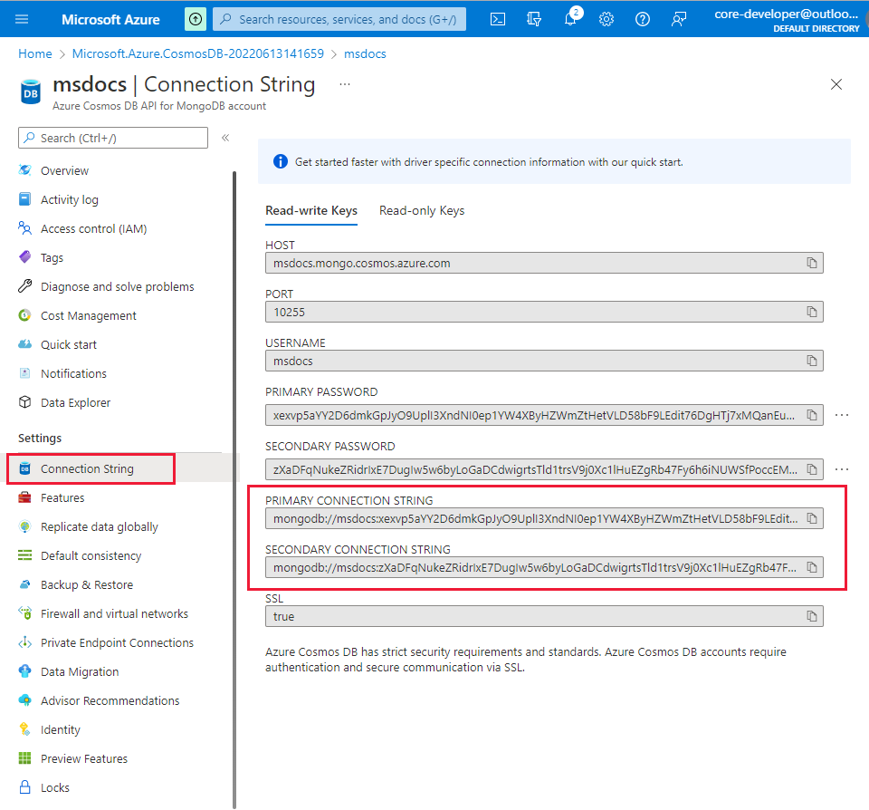
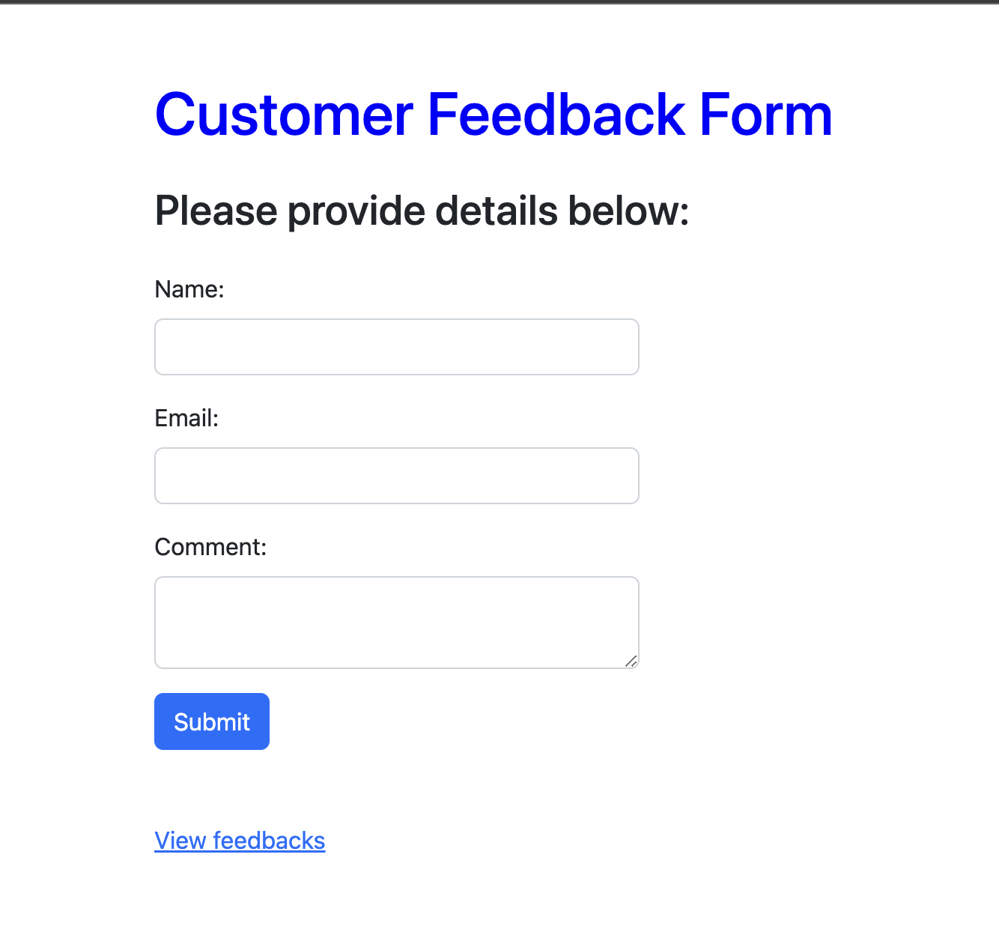

# Virtual Training Day - Azure for Developers

Sample feedback form app using Azure App Service and Azure Cosmos DB.

## Prerequisites

-  Have an Azure account with an active subscription. [Create an account for free](https://azure.microsoft.com/free/?ocid=VTD_AzureDev).
- Install [Node.js and npm](https://nodejs.org). Run the command `node --version` to verify that Node.js is installed.
- Install [Visual Studio Code](https://code.visualstudio.com?ocid=VTD_AzureDev).
- The [Azure App Service extension](https://marketplace.visualstudio.com/items?itemName=ms-azuretools.vscode-azureappservice&ocid=VTD_AzureDev) for Visual Studio Code. 
- Have a [GitHub account](https://github.com/)
- Install [GitHub Desktop](https://desktop.github.com/)

---

## Initial setup

### Install Azure App Service Extentsion for Visual Studio Code

In Visual Studio Code, in the [Activity Bar](https://code.visualstudio.com/docs/getstarted/userinterface?ocid=VTD_AzureDev), select the **Azure** logo.

1. In the **App Service** explorer, select **Sign in to Azure...** and follow the instructions.

    In Visual Studio Code, you should see your Azure email address in the Status Bar and your subscription in the **AZURE APP SERVICE** explorer.

### Configure Azure Cosmos DB instance

1. Sign in to the [Azure portal](https://portal.azure.com?ocid=VTD_AzureDev).

1. From the Azure portal menu or the **Home page**, select **Create a resource**.

1. On the **New** page, search for and select **Azure Cosmos DB**.

1. On the **Select API option** page, select the **Create** option within the **MongoDB** section. Azure Cosmos DB has five APIs: SQL, MongoDB, Gremlin, Table, and Cassandra.

1. On the **Create Azure Cosmos DB Account** page, enter the following information:

   | Setting | Value | Description |
   | --- | --- | --- |
   | Subscription | Subscription name | Select the Azure subscription that you wish to use for this Azure Cosmos DB account. |
   | Resource Group | Resource group name | Select a resource group, or select **Create new**, then enter a unique name for the new resource group. |
   | Account Name | A unique name | Enter a name to identify your Azure Cosmos DB account. The name will be used as part of a fully qualified domain name (FQDN) with a suffix of *documents.azure.com*, so the name must be globally unique. The name can only contain lowercase letters, numbers, and the hyphen (-) character. The name must also be between 3-44 characters in length. |
   | Location | The region closest to your users | Select a geographic location to host your Azure Cosmos DB account. Use the location that is closest to your users to give them the fastest access to the data. |
   | Capacity mode |Provisioned throughput or Serverless|Select **Provisioned throughput**. |
   | Apply Azure Cosmos DB free tier discount | **Apply** or **Do not apply** | Select ***Apply*** With Azure Cosmos DB free tier, you'll get the first 1000 RU/s and 25 GB of storage for free in an account. Learn more about [free tier](https://azure.microsoft.com/pricing/details/cosmos-db?ocid=VTD_AzureDev). |
   | Version | MongoDB version  | Use the default version.

1. Select **Review + create**.

1. Review the settings you provide, and then select **Create**. It takes a few minutes to create the account. Wait for the portal page to display **Your deployment is complete** before moving on.

1. Select **Go to resource** to go to the Azure Cosmos DB account page. 

1. From the Azure Cosmos DB for NoSQL account page, select the **Connection String** navigation menu option.

1. Record the values for the **PRIMARY CONNECTION STRING** field. You'll use this value in a later step.


<!-- > Grab setup instructions from quickstart https://github.com/MicrosoftDocs/azure-docs/blob/main/articles/cosmos-db/mongodb/quickstart-nodejs.md -->

---

## Configure and deploy app

### Edit configuration

1. Fork [repo](https://github.com/microsoft/AzureForDevelopers)
1. Open forked repo with GitHub Desktop
1. In GitHub Desktop, select "Open in Visual Studio Code"
1. In Visual Studio Code, open the .env file. Replace the MongoDB  Connection String

   ```.env
   PORT=3001
   MONGODB_URL="<connection string saved from above. Starts with 'mongodb://'>"
   ```

1. Save file

### Run app locally to validate Azure Cosmos DB configuration

1. In the menu bar, expand **Terminal** > Select **New Terminal**
1. Install the node modules

   ```cli
    npm install
   ```

1. Start the app

   ```cli
   node app.js
   ```

1. In a browser, navigate to http://localhost:3001. You should see something like this:



### Deploy app to Azure

1. In Visual Studio Code, in the Activity Bar, select the Azure logo.
1. Right-click on App Services and select **Create new Web App**. (A Linux container is used by default.)
1. Type a globally unique name for your web app and press **Enter**. The name must be unique across all of Azure and use only alphanumeric characters ('A-Z', 'a-z', and '0-9') and hyphens ('-').
1. In Select a runtime stack, select the Node.js version you want. An **LTS** version is recommended.
1. In Select a pricing tier, select **Free (F1)** and wait for the resources to be provisioned in Azure.
1. In the popup **Always deploy the workspace "AZUREFORDEVELOPERS" to \<app-name>"**, select **Yes**. This way, as long as you're in the same workspace, Visual Studio Code deploys to the same App Service app each time.

    While Visual Studio Code provisions the Azure resources and deploys the code, it shows [progress notifications](https://code.visualstudio.com/api/references/extension-guidelines#notifications?ocid=VTD_AzureDev).

1. Once deployment completes, select **Browse Website** in the notification popup. The browser should display the feedback form page.

---

### Redeploy updates

You can deploy changes to this app by making edits in Visual Studio Code, saving your files, and then redeploy to your Azure app. For example:

1. Open *public/index.html* and change the Title color

    ```html
    <!-- Title -->
      <div class="row mb-3">
        <h1 style="color:blue;">Customer Feedback Form</h1>
      </div>
    ```

    to

    ```html
    <!-- Title -->
      <div class="row mb-3">
        <h1 style="color:orange;">Customer Feedback Form</h1>
      </div>
    ```

1. In the **App Service** explorer, select the **Deploy to Web App** icon again, confirm by clicking **Deploy** again.
1. Wait for deployment to complete, then select **Browse Website** in the notification popup. You should see that the title is now colored orange.

---

### Contributing

This project welcomes contributions and suggestions.  Most contributions require you to agree to a
Contributor License Agreement (CLA) declaring that you have the right to, and actually do, grant us
the rights to use your contribution. For details, visit https://cla.opensource.microsoft.com.

When you submit a pull request, a CLA bot will automatically determine whether you need to provide
a CLA and decorate the PR appropriately (e.g., status check, comment). Simply follow the instructions
provided by the bot. You will only need to do this once across all repos using our CLA.

This project has adopted the [Microsoft Open Source Code of Conduct](https://opensource.microsoft.com/codeofconduct/).
For more information see the [Code of Conduct FAQ](https://opensource.microsoft.com/codeofconduct/faq/) or
contact [opencode@microsoft.com](mailto:opencode@microsoft.com) with any additional questions or comments.

### Trademarks

This project may contain trademarks or logos for projects, products, or services. Authorized use of Microsoft 
trademarks or logos is subject to and must follow 
[Microsoft's Trademark & Brand Guidelines](https://www.microsoft.com/en-us/legal/intellectualproperty/trademarks/usage/general).
Use of Microsoft trademarks or logos in modified versions of this project must not cause confusion or imply Microsoft sponsorship.
Any use of third-party trademarks or logos are subject to those third-party's policies.
